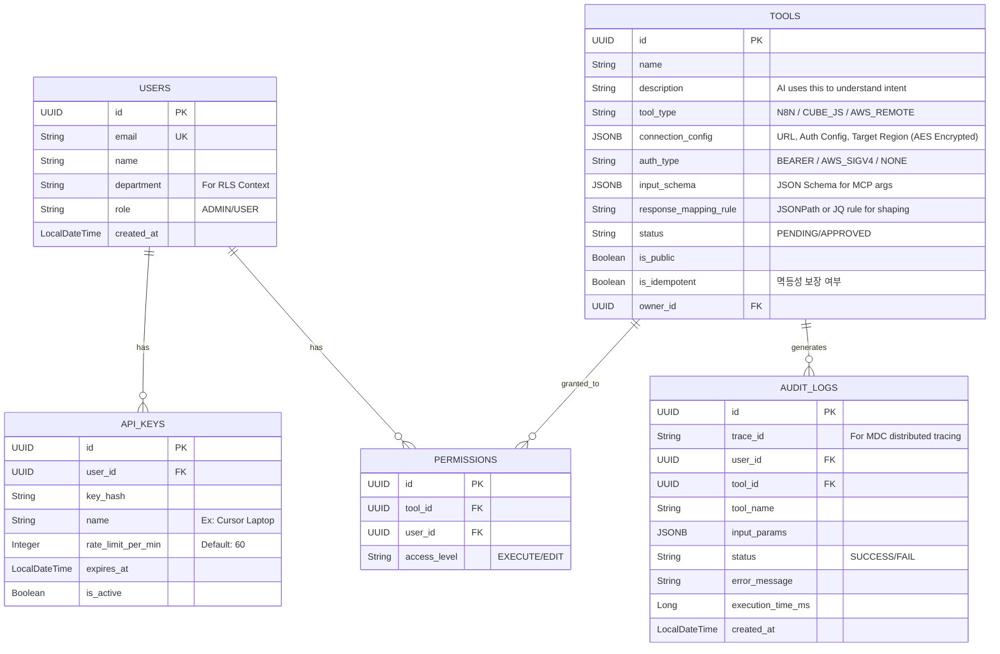

# 🚀 PRD & 세부 실행 계획: 범용 MCP 게이트웨이 (Universal MCP Gateway, UMG)

## 1. 프로젝트 개요 (Context)
* **목표:** 기업 내 파편화된 도구(n8n, Cube.js)와 **클라우드 네이티브 도구(AWS 공식 MCP 서버 등)**를 **단일 MCP 엔드포인트**로 통합 관리하는 중앙화 미들웨어 구축.
* **최신 기술 반영 (AWS MCP 통합):**
  * 최근 AWS가 발표한 공식 오픈소스 `awslabs/mcp` 서버(Redshift, S3 Tables, CloudWatch, Cost Analysis, SOPS 등)를 UMG에 연동.
  * **MCP Proxy for AWS** 개념을 내재화하여, AI Agent가 AWS 인프라에 직접 접근하지 않아도 UMG가 AWS SigV4 인증을 대행하여 안전하게 원격 AWS MCP 서버로 요청을 라우팅(Proxy)함.
* **핵심 가치:** 파편화된 도구 등록의 번거로움 해소, 강력한 중앙 거버넌스(RBAC, Rate Limit, Audit), AWS 리소스와 사내 데이터의 융합 시너지 창출.

---

## 2. 시스템 아키텍처 및 기술 스택
**AI Vibe Coding의 효율성 및 전체 문맥 유지를 위해 `Monorepo` 구조를 채택합니다.**

* **Backend:** Java 21 LTS (Virtual Threads), Spring Boot 3.3+, Spring Security, JPA
* **Frontend:** React 18+ (Vite, TS), React Query, Zustand, Tailwind CSS, `shadcn/ui`, React Hook Form
* **Database & Cache:** PostgreSQL 16+, Redis (Session, Rate Limit, Caching)
* **Integration Adapters:**
  1. **Local Wrappers:** n8n (Webhook REST), Cube.js (Semantic Layer API)
  2. **Remote Proxy (New):** AWS SigV4 기반 원격 MCP 서버 프록시 라우팅
* **Infrastructure:** Kubernetes (EKS/GKE), Nginx Ingress/ALB
* **Client Bridge:** Node.js 기반 단일 실행 파일 CLI 브릿지 (`stdio` <-> `SSE/HTTP` 프록시)

---

## 3. UI/UX 및 Vibe Coding 가이드라인 (AI 시스템 지침)
> **[UI/UX Engineering Rules for AI]**
> 1. **Visual Reference:** Vercel, Linear, Stripe의 대시보드 스타일 지향.
> 2. **Components:** HTML 태그 사용 최소화, 반드시 `shadcn/ui` 와 `lucide-react` 조합 사용.
> 3. **Styling (Tailwind):** 배경 `bg-zinc-50`, 패널 `bg-white`, 얇은 테두리(`border-border/40`), 미세한 그림자(`shadow-sm`), 필수 Hover 애니메이션.
> 4. **Information Density:** 메타데이터(생성자, 시간, 뱃지 등)를 `text-muted-foreground text-sm`로 촘촘히 배치하여 정보 밀도 극대화.
> 5. **State Completeness:** Loading Skeleton, Empty State, Error State를 한 번에 작성.

---

## 4. 20+ 다중 페르소나 및 엔터프라이즈 통합 시나리오

UMG는 다양한 직군의 요구를 충족하며 사내 보안을 유지합니다. 페르소나는 크게 4가지 그룹(22개 역할)으로 분류됩니다.

### 그룹 A: 클라우드 인프라 및 개발 그룹 (AWS MCP 적극 활용)
1. **클라우드 아키텍트:** `aws-diagram-mcp`를 통해 자연어로 아키텍처 다이어그램을 자동 생성하고 검토.
2. **DevOps 엔지니어:** 새벽 서버 장애 시 `CloudWatch MCP`를 통해 로그를 요약 분석받고, EC2->ECS 컨테이너 마이그레이션 도구 실행.
3. **데이터 엔지니어:** `Redshift MCP` 및 `S3 Tables MCP`를 활용해 LLM과 대화하며 지능형 ETL 파이프라인 스키마를 탐색 및 작성.
4. **FinOps 담당자:** `Cost Analysis MCP`를 호출해 EKS 클러스터 비용 급증 원인을 분석하고 최적화 방안 도출.
5. **프론트엔드 개발자:** `Nova Canvas MCP`로 UI 프로토타입 이미지를 생성하고, `n8n` 도구를 호출해 모의 API 데이터를 화면에 연동.
6. **QA 엔지니어:** AI에게 "결제 모듈 E2E 테스트 실행해"라고 명령하면, UMG가 `n8n` 워크플로우를 트리거하고 결과를 요약 보고.
7. **사내 AI 개발자:** 사내 슬랙 챗봇(Agent) 개발 시, UMG의 `tools/list` 하나만 연결하여 전사 표준 도구 세트를 즉시 상속받아 사용.

### 그룹 B: IT 보안 및 거버넌스 그룹
8. **보안 담당자:** AWS `SOPS(Secrets OPerationS) Deployment Agent MCP`를 통해 암호화된 시크릿 접근 내역을 감사하고, UMG Audit Log로 비정상 호출 탐지.
9. **법무/컴플라이언스 담당자:** `AWS Documentation MCP`와 사내 규정 뷰어(Cube.js)를 크로스체크하여 새로운 아키텍처가 금융 규제에 맞는지 검토.
10. **시스템 관리자 (Admin):** UMG 대시보드에서 각 부서 및 Agent별 API 호출 횟수(Quota/Rate Limit)를 설정하고 어뷰징 차단.
11. **기획팀 파트장 (Team Lead):** 팀원들이 요청한 특정 민감 도구(Cube.js HR 뷰 등)에 대해 3개월 한시적 접근 권한 승인(Maker-Checker).

### 그룹 C: 데이터 및 백오피스 운영 그룹
12. **ERP 담당자 (Data Steward):** Cube.js에 `Finance_View`를 정의하고 UMG에 연동. AI가 엉뚱한 쿼리를 날리지 못하도록 허용된 필터만 JSON Schema로 노출.
13. **MES 담당자:** 공장 설비 상태를 제어하는 레거시 API를 `n8n`으로 감싼 뒤, UMG에 `machine_controller` 도구로 등록.
14. **시스템 운영자:** 인프라 장애 발생 시, UMG와 연동된 AI가 자동 복구 워크플로우(n8n)를 제안하고 승인 시 즉시 실행.
15. **재무팀:** "3분기 예산 대비 지출 표 생성해"라고 AI에 요청. AI는 SQL을 짜는 대신 Cube.js 도구 규격에 맞는 JSON 파라미터만 전송하여 안전하게 정확한 재무 데이터 반환.
16. **HR 담당자:** "이번 달 퇴사율과 부서별 평균 연봉"을 질문. UMG가 Cube.js에 HR 권한을 주입하여 익명화된 집계 데이터만 안전하게 제공.
17. **구매팀:** AI에게 공급사 단가표를 요구. UMG는 사용자의 부서(구매팀) 정보를 Cube.js로 전달하여 **Row-Level Security(RLS)**가 적용된 맞춤형 단가만 반환.

### 그룹 D: 비즈니스 및 현장 활용 그룹
18. **현장직 근로자:** 방폭 스마트폰 앱에서 음성으로 "3번 라인 온도 확인해" 요청. AI가 MES 담당자가 만든 도구를 호출해 즉시 상태 보고.
19. **자재팀:** "B창고 재고 50개로 조정" 명령. UMG는 멱등성(Idempotency) 검증 후 n8n 쓰기 도구를 실행하여 중복 차감을 방지.
20. **오피스 임원:** "어제 생산 목표 미달 공장과 그로 인한 재무 손실액 요약해." AI가 MES 도구와 ERP 도구를 **체이닝(Chaining)** 호출하여 융합 보고서 생성.
21. **마케팅 담당자:** CRM 데이터 뷰어(Cube.js)를 분석한 AI가, n8n 이메일 발송 도구를 연속 호출하여 타겟 프로모션 캠페인 자동화.
22. **CS/고객지원:** 고객 문의 발생 시, AI가 통합 고객 DB(Cube.js) 도구를 통해 최근 클레임과 환불 상태를 1초 만에 가져와 상담원에게 제공.

---

## 5. 시스템 기능 및 비기능 요구사항 (System & NFR Specs)

### 5.1. 도구 연동 및 프록시 아키텍처 (Core Adapter & Proxy)
* **어댑터 타입 1: Local HTTP/REST (n8n, 일반 API)**
  * AI가 생성한 인자를 JSON Body로 변환하여 POST 전송.
* **어댑터 타입 2: Semantic Layer (Cube.js)**
  * Text-to-SQL의 환각을 방지하기 위해 AI는 사전 정의된 Dimension/Measure JSON만 생성하고, 어댑터가 이를 Cube 쿼리로 변환.
* **어댑터 타입 3: Remote MCP Proxy (AWS MCP 연동)**
  * AWS 환경(VPC 내)에 배포된 원격 MCP 서버들(Redshift, CloudWatch 등)로 요청을 포워딩.
  * UMG가 AWS IAM 역할을 부여받아 **AWS SigV4 인증 서명**을 생성하여 원격 서버에 안전하게 접속. AI Agent에게는 AWS 인증 정보(Secret Key)가 절대 노출되지 않음.

### 5.2. 세션, 병렬 처리 및 자원 관리
* **Virtual Threads 활성화:** Java 21의 가상 스레드를 활용하여, 수천 개의 AI Agent가 동시에 맺는 SSE 장기 연결(Long-polling)을 최소한의 메모리로 처리.
* **커넥션 풀 및 타임아웃 방어:** n8n 호출이나 AWS 외부 I/O 시 Read Timeout을 15초로 캡슐화하여 스레드 행(Hang) 방지.

### 5.3. 보안, 멱등성 및 거버넌스
* **비밀번호/토큰 관리:** `connection_config` 내의 Webhook Token 등은 DB 저장 시 **AES-256 양방향 암호화** 필수 적용.
* **비용 통제 (Rate Limiting):** `Bucket4j` + Redis를 활용해 API Key 기반 Token Bucket 적용 (초과 시 `429 Too Many Requests`).
* **멱등성 보장 (Idempotency):** 상태를 변경하는(n8n Write 등) 도구 실행 시, 요청 헤더의 `Idempotency-Key`를 Redis에 저장하여 24시간 내 동일 키 재요청 시 이전 결과를 그대로 반환 (재시도로 인한 사고 방지).
* **Context-Aware RLS:** Cube.js 쿼리 전송 시 HTTP Header(`X-User-Context`)에 요청자의 부서/직급 정보를 주입하여 백엔드 레벨의 행 단위 보안(Row-Level Security) 달성.

### 5.4. 예외 처리 및 응답 최적화 (Response Shaping)
* 외부 API의 방대한 원본 JSON 응답으로 인한 'LLM 토큰 한도 초과' 방지.
* 도구 등록 시 작성한 `JsonPath` 또는 `JQ` 규칙을 적용하여, 백엔드에서 필요한 데이터만 텍스트나 마크다운 표 형태로 필터링(Shaping)한 후 AI에게 반환.

---

## 6. 세부 실행 계획 (AI Vibe Coding Phasing)

AI 에이전트에게 "Phase X부터 작업을 시작해줘"라고 단계별로 지시하십시오.

### **Phase 1: Foundation & Auth (기반 시스템 및 인프라)**
* `docker-compose.yml` (Postgres, Redis) 작성 및 Spring Boot 3.3 (Virtual Threads 활성화) 세팅.
* Web UI용 세션 관리 및 Agent용 `ApiKeyAuthFilter` 보안 체인 구축. 예외 처리용 전역 핸들러 구현.

### **Phase 2: Core Domain & Data Model (도구 관리 로직)**
* `Tool`, `Permission`, `AuditLog` 엔티티 및 Repository 생성. (AES-256 Converter 포함).
* 도구 CRUD 및 관리자 승인(Maker-Checker) 비즈니스 로직 구현.
* 프론트엔드(`frontend/`) Vite+React 초기화. Vercel 스타일 UI 뼈대 구축.

### **Phase 3: Frontend UX, Wizard & Playground**
* `react-hook-form` + `zod` 기반 도구 생성 위저드 (n8n, Cube, AWS 원격 서버 타입 선택 기능 포함).
* 도구 목록 카드 UI 및 모의 테스트를 위한 Test Playground 뷰어 구현.

### **Phase 4: MCP Protocol & Hybrid Execution Engine (핵심 엔진)**
* `/api/mcp` 엔드포인트(SSE/HTTP) 개설. 권한 기반 `tools/list` RPC 핸들러 구현.
* `ToolExecutor` 인터페이스 정의 및 구현체 작성:
  1. `N8nAdapter`
  2. `CubeJsAdapter`
  3. `AwsRemoteMcpProxyAdapter` (AWS SigV4 Request Signer 적용)
* Redis 기반 멱등성(Idempotency) 검증 로직 적용.

### **Phase 5: Optimization & Client Bridge**
* JsonPath 파서 기반 백엔드 응답 가공(Response Shaping) 로직 추가.
* `bridge/` 폴더에 로컬 IDE(Cursor 등)와 통신하기 위한 Node.js 기반 `stdio-to-sse` CLI 프록시 작성.

### **Phase 6: Observability & Enterprise Governance**
* `Bucket4j` 기반 API Rate Limiting 적용.
* `@Async`를 활용한 Audit Log 분리 적재 및 ELK 포맷 로깅(MDC TraceId 주입).
* 일 단위 Cube.js/n8n/AWS 메타데이터 스키마 검증 배치(`@Scheduled`) 추가.

---

## 7. 데이터베이스 스키마 설계 (ERD)

