# PRD & 세부 실행 계획: 범용 MCP 게이트웨이 (Universal MCP Gateway, UMG)

## 1. 프로젝트 개요 (Context)
* **목표:** 기업 내 파편화된 도구(n8n, Cube.js)와 **클라우드 네이티브 도구(AWS 공식 MCP 서버 등)**를 **단일 MCP 엔드포인트**로 통합 관리하는 중앙화 미들웨어 구축.
* **최신 기술 반영 (AWS MCP 통합):**
  * 최근 AWS가 발표한 공식 오픈소스 `awslabs/mcp` 서버(Redshift, S3 Tables, CloudWatch, Cost Analysis, SOPS 등)를 UMG에 연동.
  * **MCP Proxy for AWS** 개념을 내재화하여, AI Agent가 AWS 인프라에 직접 접근하지 않아도 UMG가 AWS SigV4 인증을 대행하여 안전하게 원격 AWS MCP 서버로 요청을 라우팅(Proxy)함.
* **핵심 가치:** 파편화된 도구 등록의 번거로움 해소, 강력한 중앙 거버넌스(RBAC, Rate Limit, Audit), AWS 리소스와 사내 데이터의 융합 시너지 창출.

---

## 2. 시스템 아키텍처 및 기술 스택
**AI Vibe Coding의 효율성 및 전체 문맥 유지를 위해 `Monorepo` 구조를 채택합니다.**

* **Backend:** Java 21 LTS (Virtual Threads), Spring Boot 3.3+, Spring Security 6, JPA/Hibernate
* **Frontend:** React 18+ (Vite 5, TypeScript 5), React Query 5 (TanStack), Zustand, Tailwind CSS 3, React Hook Form + Zod
* **Database & Cache:** PostgreSQL 16+ (Flyway 마이그레이션), Redis 7+ (세션, 속도 제한, 캐싱)
* **Integration Adapters:**
  1. **Local Wrappers:** n8n (Webhook REST), Cube.js (Semantic Layer API)
  2. **Remote Proxy:** AWS SigV4 기반 원격 MCP 서버 프록시 라우팅
* **Infrastructure:** Docker Compose (개발), Kubernetes (EKS/GKE, 프로덕션), Nginx
* **Client Bridge:** Node.js 기반 CLI 브릿지 (`stdio` <-> `HTTP/SSE` 프록시)

---

## 3. UI/UX 디자인 가이드라인

### 3.1. 디자인 원칙
> 1. **색상 시스템:** 화이트(#ffffff)와 진한 회색(#1a1a1a) 투톤 컬러 스킴
> 2. **플랫 디자인:** 그림자(shadow), 3D 효과 없음. 완전한 플랫 디자인
> 3. **부분 테두리:** 전체 테두리 대신 **왼쪽 + 하단** 테두리만 사용하는 시그니처 패턴
> 4. **아이콘/이모지 금지:** 텍스트 라벨만 사용하여 정보 전달
> 5. **정보 밀도 극대화:** Vercel/Linear/Stripe 스타일의 촘촘한 메타데이터 배치
> 6. **상태 완전성:** Loading Skeleton, Empty State, Error State를 모든 데이터 뷰에 적용
> 7. **반응형 디자인:** 모바일-퍼스트, sm:/md:/lg: 브레이크포인트로 유연한 화면 대응

### 3.2. CSS 컴포넌트 클래스
| 클래스 | 용도 |
|--------|------|
| `.card` | 기본 카드 (왼쪽 강조 + 하단 테두리) |
| `.card-subtle` | 서브틀 카드 (얇은 왼쪽 + 하단 테두리) |
| `.section-header` | 섹션 제목 (왼쪽 강조 테두리 + 패딩) |
| `.stat-block` | 통계 블록 (왼쪽 + 하단 테두리) |
| `.nav-item` / `.nav-item-active` | 네비게이션 항목 |
| `.table-row` | 테이블 행 (하단 테두리 + 호버) |
| `.input-field` | 입력 필드 (왼쪽 + 하단 테두리) |
| `.btn-primary` / `.btn-secondary` | 버튼 스타일 |
| `.badge-*` | 상태 뱃지 (success, warning, error, info) |

### 3.3. 타이포그래피
* **폰트:** Inter (산세리프), JetBrains Mono (모노스페이스)
* **스케일:** text-2xs ~ text-2xl 계층 구조
* **규칙:** 제목에 `tracking-tight`, 라벨에 `uppercase tracking-wider`, 수치에 `tabular-nums`

---

## 4. 20+ 다중 페르소나 및 엔터프라이즈 통합 시나리오

UMG는 다양한 직군의 요구를 충족하며 사내 보안을 유지합니다. 페르소나는 크게 4가지 그룹(22개 역할)으로 분류됩니다.

### 그룹 A: 클라우드 인프라 및 개발 그룹 (AWS MCP 적극 활용)
1. **클라우드 아키텍트:** `aws-diagram-mcp`를 통해 자연어로 아키텍처 다이어그램을 자동 생성하고 검토.
2. **DevOps 엔지니어:** 새벽 서버 장애 시 `CloudWatch MCP`를 통해 로그를 요약 분석받고, EC2->ECS 컨테이너 마이그레이션 도구 실행.
3. **데이터 엔지니어:** `Redshift MCP` 및 `S3 Tables MCP`를 활용해 LLM과 대화하며 지능형 ETL 파이프라인 스키마를 탐색 및 작성.
4. **FinOps 담당자:** `Cost Analysis MCP`를 호출해 EKS 클러스터 비용 급증 원인을 분석하고 최적화 방안 도출.
5. **프론트엔드 개발자:** `Nova Canvas MCP`로 UI 프로토타입 이미지를 생성하고, `n8n` 도구를 호출해 모의 API 데이터를 화면에 연동.
6. **QA 엔지니어:** AI에게 "결제 모듈 E2E 테스트 실행해"라고 명령하면, UMG가 `n8n` 워크플로우를 트리거하고 결과를 요약 보고.
7. **사내 AI 개발자:** 사내 슬랙 챗봇(Agent) 개발 시, UMG의 `tools/list` 하나만 연결하여 전사 표준 도구 세트를 즉시 상속받아 사용.

### 그룹 B: IT 보안 및 거버넌스 그룹
8. **보안 담당자:** AWS `SOPS Deployment Agent MCP`를 통해 암호화된 시크릿 접근 내역을 감사하고, UMG Audit Log로 비정상 호출 탐지.
9. **법무/컴플라이언스 담당자:** `AWS Documentation MCP`와 사내 규정 뷰어(Cube.js)를 크로스체크하여 새로운 아키텍처가 금융 규제에 맞는지 검토.
10. **시스템 관리자 (Admin):** UMG 대시보드에서 각 부서 및 Agent별 API 호출 횟수(Quota/Rate Limit)를 설정하고 어뷰징 차단.
11. **기획팀 파트장 (Team Lead):** 팀원들이 요청한 특정 민감 도구(Cube.js HR 뷰 등)에 대해 3개월 한시적 접근 권한 승인(Maker-Checker).

### 그룹 C: 데이터 및 백오피스 운영 그룹
12. **ERP 담당자 (Data Steward):** Cube.js에 `Finance_View`를 정의하고 UMG에 연동.
13. **MES 담당자:** 공장 설비 상태를 제어하는 레거시 API를 `n8n`으로 감싼 뒤, UMG에 `machine_controller` 도구로 등록.
14. **시스템 운영자:** 인프라 장애 발생 시, UMG와 연동된 AI가 자동 복구 워크플로우(n8n)를 제안하고 승인 시 즉시 실행.
15. **재무팀:** AI에 "3분기 예산 대비 지출 표 생성해"라고 요청. Cube.js 도구 규격에 맞는 JSON 파라미터만 전송하여 안전하게 정확한 재무 데이터 반환.
16. **HR 담당자:** "이번 달 퇴사율과 부서별 평균 연봉"을 질문. Cube.js에 HR 권한을 주입하여 익명화된 집계 데이터만 안전하게 제공.
17. **구매팀:** AI에게 공급사 단가표를 요구. 사용자의 부서 정보를 Cube.js로 전달하여 **RLS**가 적용된 맞춤형 단가만 반환.

### 그룹 D: 비즈니스 및 현장 활용 그룹
18. **현장직 근로자:** 방폭 스마트폰 앱에서 음성으로 "3번 라인 온도 확인해" 요청. MES 담당자가 만든 도구를 호출해 즉시 상태 보고.
19. **자재팀:** "B창고 재고 50개로 조정" 명령. 멱등성(Idempotency) 검증 후 n8n 쓰기 도구를 실행하여 중복 차감을 방지.
20. **오피스 임원:** "어제 생산 목표 미달 공장과 재무 손실액 요약해." MES 도구와 ERP 도구를 **체이닝(Chaining)** 호출하여 융합 보고서 생성.
21. **마케팅 담당자:** CRM 데이터 뷰어를 분석한 AI가, n8n 이메일 발송 도구를 연속 호출하여 타겟 프로모션 캠페인 자동화.
22. **CS/고객지원:** 고객 문의 발생 시, 통합 고객 DB 도구를 통해 최근 클레임과 환불 상태를 1초 만에 가져와 상담원에게 제공.

---

## 5. 시스템 기능 및 비기능 요구사항 (System & NFR Specs)

### 5.1. 도구 연동 및 프록시 아키텍처 (Core Adapter & Proxy)
* **어댑터 타입 1: Local HTTP/REST (n8n, 일반 API)**
  * AI가 생성한 인자를 JSON Body로 변환하여 POST 전송.
* **어댑터 타입 2: Semantic Layer (Cube.js)**
  * Text-to-SQL의 환각을 방지하기 위해 AI는 사전 정의된 Dimension/Measure JSON만 생성하고, 어댑터가 이를 Cube 쿼리로 변환.
* **어댑터 타입 3: Remote MCP Proxy (AWS MCP 연동)**
  * AWS 환경(VPC 내)에 배포된 원격 MCP 서버들로 요청을 포워딩.
  * UMG가 AWS IAM 역할을 부여받아 **AWS SigV4 인증 서명**을 생성하여 원격 서버에 안전하게 접속.

### 5.2. 세션, 병렬 처리 및 자원 관리
* **Virtual Threads 활성화:** Java 21의 가상 스레드를 활용하여 수천 개의 AI Agent 동시 SSE 연결을 최소 메모리로 처리.
* **커넥션 풀 및 타임아웃 방어:** 외부 I/O 시 Read Timeout을 15초로 캡슐화하여 스레드 행(Hang) 방지.

### 5.3. 보안, 멱등성 및 거버넌스
* **비밀번호/토큰 관리:** `connection_config` 내의 Webhook Token 등은 DB 저장 시 **AES-256 양방향 암호화** 적용.
* **비용 통제 (Rate Limiting):** `Bucket4j` + Redis를 활용해 API Key 기반 Token Bucket 적용 (초과 시 `429`).
* **멱등성 보장 (Idempotency):** 상태를 변경하는 도구 실행 시, `Idempotency-Key`를 Redis에 저장하여 24시간 내 동일 키 재요청 시 이전 결과 반환.
* **Context-Aware RLS:** Cube.js 쿼리 전송 시 `X-User-Context` 헤더에 요청자의 부서/직급 정보를 주입하여 행 단위 보안 달성.

### 5.4. 예외 처리 및 응답 최적화 (Response Shaping)
* 외부 API의 방대한 원본 JSON 응답으로 인한 'LLM 토큰 한도 초과' 방지.
* `JsonPath` 또는 `JQ` 규칙을 적용하여 필요한 데이터만 필터링(Shaping)한 후 AI에게 반환.

### 5.5. 추가 구현 기능 (Implementation Additions)
* **Test Playground:** 도구의 입력 스키마 기반 동적 폼 생성 및 실시간 테스트 실행
* **대시보드 통계:** 도구별 실행 횟수, 오류율, 응답 시간 시각화 (Recharts 차트)
* **도구 생성 위저드:** 멀티 스텝 폼 (기본 정보 -> 연결 설정 -> 입력 스키마 -> 응답 규칙 -> 검토)
* **이중 인증 체인:** 웹 UI용 JWT 세션 + 에이전트용 API 키 인증 병렬 운용
* **Gradle 빌드 시스템:** 멀티 모듈 빌드 지원, Eclipse Temurin JDK 21
* **Bridge CLI:** Commander.js 기반 CLI 도구 (stdio-to-HTTP 프록시, 상세 에러 핸들링)
* **Docker 멀티 스테이지 빌드:** 최적화된 프로덕션 이미지 (백엔드: ZGC + Alpine, 프론트엔드: Nginx Alpine)

---

## 6. 세부 실행 계획 (AI Vibe Coding Phasing)

### **Phase 1: Foundation & Auth (기반 시스템 및 인프라)** -- 완료
* `docker-compose.yml` (Postgres 16, Redis 7) 작성 및 Spring Boot 3.3 (Virtual Threads 활성화) 세팅.
* Web UI용 JWT 세션 관리 및 Agent용 `ApiKeyAuthFilter` 보안 체인 구축.
* `GlobalExceptionHandler` 전역 예외 핸들러 구현.
* Flyway 마이그레이션 (`V1__init_schema.sql`, `V2__seed_data.sql`).

### **Phase 2: Core Domain & Data Model (도구 관리 로직)** -- 완료
* `User`, `Tool`, `ApiKey`, `Permission`, `AuditLog` 엔티티 및 Repository 생성.
* AES-256 `AttributeConverter` 포함.
* 도구 CRUD 및 관리자 승인(Maker-Checker) 비즈니스 로직 구현.
* Vite+React 프론트엔드 초기화. 투톤 디자인 시스템 구축.

### **Phase 3: Frontend UX, Wizard & Playground** -- 완료
* `react-hook-form` + `zod` 기반 도구 생성 멀티스텝 위저드.
* 도구 목록 카드 UI (부분 테두리 디자인) 및 Test Playground 뷰어 구현.
* 대시보드, API 키 관리, 권한 관리, 감사 로그, 설정 페이지 구현.

### **Phase 4: MCP Protocol & Hybrid Execution Engine (핵심 엔진)** -- 완료
* `/api/mcp` 엔드포인트(SSE/HTTP) 개설. 권한 기반 `tools/list` RPC 핸들러 구현.
* `ToolExecutor` 인터페이스 정의 및 구현체 작성:
  1. `N8nAdapter` - HTTP POST 웹훅
  2. `CubeJsAdapter` - 시맨틱 레이어 쿼리 + RLS
  3. `AwsRemoteMcpProxyAdapter` - AWS SigV4 서명 프록시
* `ToolExecutorFactory` - 어댑터 팩토리 패턴.
* Redis 기반 멱등성(Idempotency) 검증 로직 적용.

### **Phase 5: Optimization & Client Bridge** -- 완료
* `ResponseShaper` - JsonPath 파서 기반 백엔드 응답 가공 로직.
* `bridge/` - Node.js CLI (`stdio-to-HTTP` 프록시, Commander.js, 에러 핸들링).
* Nginx 리버스 프록시 설정 (SPA 라우팅, API 프록시, SSE 지원).

### **Phase 6: Observability & Enterprise Governance** -- 완료
* `Bucket4j` 기반 API Rate Limiting (`RateLimitConfig`, `RateLimitFilter`).
* `@Async`를 활용한 Audit Log 분리 적재 및 MDC TraceId 주입 로깅.
* 프로덕션 Docker 이미지 빌드 (멀티 스테이지, ZGC, Alpine).

---

## 7. 데이터베이스 스키마 설계 (ERD)

```mermaid
erDiagram
    USERS {
        UUID id PK
        String email UK
        String name
        String password_hash "BCrypt"
        String department "RLS 컨텍스트용"
        String role "ADMIN/USER"
        Boolean is_active "기본값: true"
        TimestampTZ created_at
        TimestampTZ updated_at
    }
    API_KEYS {
        UUID id PK
        UUID user_id FK
        String key_hash "SHA-256 단방향 해시"
        String name "예: Cursor 노트북"
        Integer rate_limit_per_min "기본값: 60"
        TimestampTZ expires_at
        Boolean is_active
        TimestampTZ created_at
    }
    TOOLS {
        UUID id PK
        String name
        String description "AI가 의도를 파악하는 데 사용"
        String tool_type "N8N / CUBE_JS / AWS_REMOTE"
        TEXT connection_config "AES-256 암호화 저장"
        String auth_type "BEARER / AWS_SIGV4 / NONE"
        JSONB input_schema "MCP 인자용 JSON Schema"
        TEXT response_mapping_rule "JSONPath 또는 JQ 규칙"
        String status "PENDING/APPROVED/REJECTED"
        Boolean is_public
        Boolean is_idempotent "멱등성 보장 여부"
        UUID owner_id FK
        TimestampTZ created_at
        TimestampTZ updated_at
    }
    PERMISSIONS {
        UUID id PK
        UUID tool_id FK
        UUID user_id FK
        String access_level "EXECUTE/EDIT"
        TimestampTZ created_at
    }
    AUDIT_LOGS {
        UUID id PK
        String trace_id "MDC 분산 추적용"
        UUID user_id FK
        UUID tool_id FK
        String tool_name
        JSONB input_params
        String status "SUCCESS/FAIL"
        TEXT error_message
        BigInt execution_time_ms
        TimestampTZ created_at
    }

    USERS ||--o{ API_KEYS : "보유"
    USERS ||--o{ PERMISSIONS : "권한 부여"
    USERS ||--o{ TOOLS : "소유"
    TOOLS ||--o{ PERMISSIONS : "접근 허용"
    TOOLS ||--o{ AUDIT_LOGS : "실행 기록"
    USERS ||--o{ AUDIT_LOGS : "행위 기록"
```



---

## 8. 프로젝트 구조

```
public_mcp_portal/
+-- backend/                    Spring Boot 3.3+ API 서버
|   +-- src/main/java/com/umg/
|   |   +-- config/             설정 빈 (AES, Redis, CORS, Async 등)
|   |   +-- controller/         REST API 컨트롤러
|   |   +-- service/            비즈니스 로직
|   |   +-- adapter/            도구 실행 어댑터 (N8N, Cube.js, AWS)
|   |   +-- mcp/                MCP 프로토콜 핸들러
|   |   +-- security/           인증/인가 (JWT, API 키, 속도 제한)
|   |   +-- domain/             JPA 엔티티 및 열거형
|   |   +-- repository/         데이터 접근 레이어
|   |   +-- dto/                요청/응답 DTO
|   |   +-- exception/          커스텀 예외 및 전역 핸들러
|   |   +-- util/               유틸리티 클래스
|   +-- src/main/resources/
|   |   +-- db/migration/       Flyway SQL 마이그레이션
|   +-- build.gradle            Gradle 빌드 설정
|   +-- Dockerfile              멀티 스테이지 빌드
|
+-- frontend/                   React 18+ 대시보드 UI
|   +-- src/
|   |   +-- components/         공통 및 레이아웃 컴포넌트
|   |   +-- pages/              라우트 페이지 (10개)
|   |   +-- api/                React Query 훅 (6개)
|   |   +-- stores/             Zustand 상태 관리 (2개)
|   |   +-- types/              TypeScript 타입 정의
|   |   +-- lib/                유틸리티 함수
|   |   +-- styles/             글로벌 CSS 및 디자인 시스템
|   +-- Dockerfile              멀티 스테이지 빌드
|   +-- nginx.conf              Nginx SPA 라우팅 + API 프록시
|
+-- bridge/                     Node.js CLI 브릿지
|   +-- src/index.ts            stdio-to-HTTP 프록시
|
+-- docs/                       문서
|   +-- PRD.md                  제품 요구사항 문서
|   +-- ARCHITECTURE.md         시스템 아키텍처 가이드
|   +-- INSTALLATION.md         설치 가이드
|   +-- RUNNING.md              실행 및 API 참조
|   +-- RELEASE.md              릴리즈 프로세스 가이드
|
+-- scripts/                    빌드/배포 스크립트
+-- docker-compose.yml          프로덕션 구성
+-- docker-compose.dev.yml      개발 인프라 (Postgres + Redis)
+-- .env.example                환경 변수 템플릿
+-- .gitignore                  Git 무시 규칙
```

---

## 9. 문서 목록

| 문서 | 위치 | 설명 |
|------|------|------|
| PRD | `docs/PRD.md` | 제품 요구사항 및 실행 계획 |
| 아키텍처 가이드 | `docs/ARCHITECTURE.md` | 시스템 설계, 보안 모델, 확장성 |
| 설치 가이드 | `docs/INSTALLATION.md` | 사전 요구사항, 설치, 설정 참조 |
| 실행 가이드 | `docs/RUNNING.md` | API 참조, 브릿지 CLI, 모니터링 |
| 릴리즈 가이드 | `docs/RELEASE.md` | 버전 관리, 배포, CI/CD |
